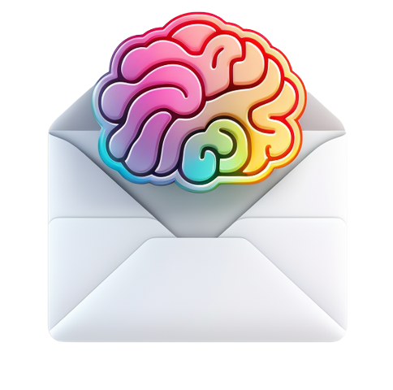

# email-discriminator

This is a project for the MLOps Zoomcamp Course where I'll be creating an email discriminator

## Problem Description

### Introduction

Emails have become a primary source of information in our digital age. However, with the sheer volume of emails received daily, it can be challenging to manage and filter out relevant information. An email discriminator, a tool that classifies or filters emails based on their relevance, can assist with this information overload.

In this project, we focus on a specific type of emails: the "TLDR" (Too Long, Didn't Read) newsletters from [tldr.tech](https://tldr.tech/). These newsletters provide summarized versions of the latest news in tech and AI. But, as with any newsletter, not all articles are of interest to every reader.

### Problem Statement

The goal of this project is to develop an email discriminator to filter the TLDR newsletters and identify the articles that are most relevant to the user.

The problem is a binary classification task with two classes:

* Class 1: Relevant TLDR articles

* Class 0: Irrelevant TLDR articles

The model will take as input the text of a TLDR article and output a prediction of whether it is relevant (Class 1) or not (Class 0).

### Data

The data for this project comes from the user's Gmail account. The user has MANUALLY categorised the TLDRs into different labels:

* TLDRs that the user cares about are in a Gmail label called "TLDRs". These TLDRs will form the positive class (Class 1).

* "Archived" TLDRs that the user doesn't care about will form the negative class (Class 0).

* TLDRs in the "inbox" are the ones on which the model will make predictions.
Each TLDR contains a title and text, which are the features that the model will use to make predictions. The label (relevant or not) is the target variable.

Where and how these are stored in Gmail depends on the user, but in this case this is how I'm storing it.

### Approach

The approach to solving this problem involves several steps:

1. **Data Collection**: Using the Gmail API to fetch the TLDRs from the different Gmail labels. I'm dumping the data into a CSV file in the `data` folder.

2. **Data Exploration**: Loading, analysing and visualising the data. This will be done in the notebook [notebooks/tld_articles_exploration.ipynb](notebooks/tld_articles_exploration.ipynb).

3. **Model Exploration**: Experimenting with different machine learning models to solve the task at hand. This will be done in the notebook [notebooks/tld_articles_model_exploration.ipynb](notebooks/tld_articles_model_exploration.ipynb) where we will use MLFlow as model experimentation tool.

4. **Model as Service**: Code refactoring and creation of a batch model service.

5. **Model Deployment**: Deploying the model to a production environment where it can make predictions on new, unseen TLDRs.

### Deployment procedure

https://medium.com/@danilo.drobac/7-a-complete-google-cloud-deployment-of-prefect-2-0-32b8e3c2febe

1. `prefect init` to create a new prefect project.

2. `prefect deploy` to deploy flows.

3. `docker build --platform linux/amd64 -t europe-west1-docker.pkg.dev/mlops-389311/email-discriminator/email-discriminator:1 .`

4. `docker push europe-west1-docker.pkg.dev/mlops-389311/email-discriminator/email-discriminator:1`

5. `python flow-deployment.py`

TODO: Automatically refresh GMAIL API token
