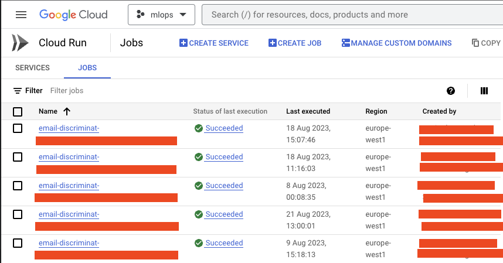
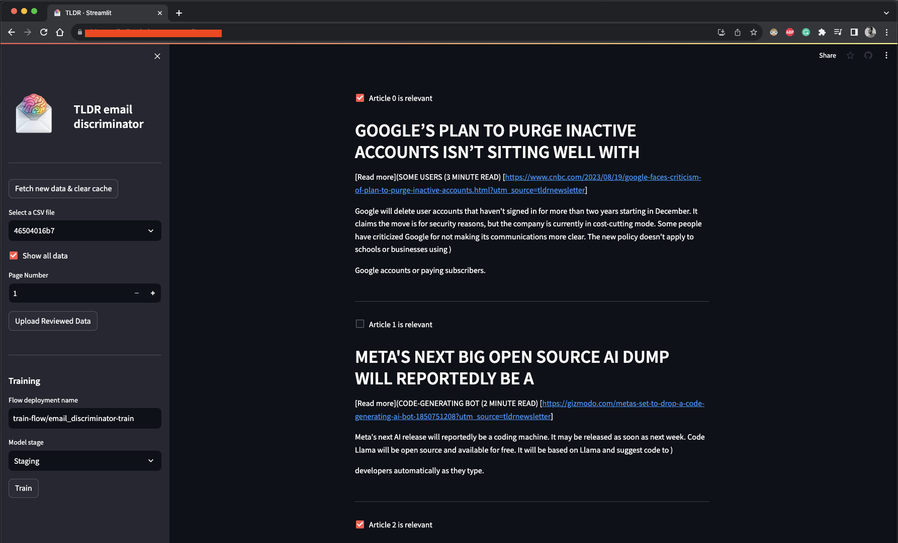

[](https://codecov.io/gh/ugm2/email-discriminator)

This is a project for the MLOps Zoomcamp Course where I'll be creating an email discriminator

## Problem Description

### Introduction

Emails have become a primary source of information in our digital age. However, with the sheer volume of emails received daily, it can be challenging to manage and filter out relevant information. An email discriminator, a tool that classifies or filters emails based on their relevance, can assist with this information overload.

In this project, we focus on a specific type of emails: the "TLDR" (Too Long, Don't Read) newsletters from [tldr.tech](https://tldr.tech/). These newsletters provide summarized versions of the latest news in tech and AI. But, as with any newsletter, not all articles are of interest to every reader.

### Problem Statement

The goal of this project is to develop an email discriminator to filter the TLDR newsletters and identify the articles that are most relevant to the user.

The problem is a binary classification task with two classes:

* Class 1: Relevant TLDR articles

* Class 0: Irrelevant TLDR articles

The model will take as input the text of a TLDR article and output a prediction of whether it is relevant (Class 1) or not (Class 0).

Each email contains several TLDR articles that we have to break down and classify.

### Data

The data for this project comes from the user's Gmail account. **The user has MANUALLY categorised the TLDRs into different labels**:

* TLDRs that the user cares about are in a Gmail label called "TLDRs". These TLDRs will form the positive class (Class 1).

* "Archived" TLDRs that the user doesn't care about will form the negative class (Class 0).

* TLDRs in the "inbox" are the ones on which the model will make predictions.
Each TLDR contains a title and text, which are the features that the model will use to make predictions. The label (relevant or not) is the target variable.

Where and how these are stored in Gmail depends on the user, but in this case this is how I'm storing it.

## Approach

It's a much more complex problem than I thought it would be, because it involves talking to the Gmail API and a lot of different processes to handle the fetching, syncing and removing of the data (emails).


The approach to solving this problem involves several steps:

1. **Get and store initial labeled data**: Using the Gmail API to fetch the TLDRs from the different Gmail labels. I'm dumping the data into a CSV file in the `data` folder. Later on, this data was stored in a GCP bucket for reproducibility. I have a Prefect flow for this process, but it's not deployed because it only needs to be executed once (but it would be nice to have).

2. **Train & deploy initial ML model**: This process involves 3 stages:

    2.1 **Data Exploration**: Loading, analysing and visualising the data. This was done in the notebook [notebooks/tld_articles_exploration.ipynb](notebooks/tld_articles_exploration.ipynb).

    2.2 **Model Exploration**: Experimenting with different machine learning models to solve the task at hand. This was also done in the notebook [notebooks/tld_articles_model_exploration.ipynb](notebooks/tld_articles_model_exploration.ipynb) where I used MLFlow as model experimentation tool. MLFlow has been set up in GCP.

    These 2 steps are mentioned in the diagram as **Data & Model Exploration**

    2.3 **Model Deployment**: Once the model is selected, we just put the initial model into production using MLFlow.

3. **Weekly Batch Process**: Once the first model is deployed, we enter a weekly batch process that involves multiple steps: fetching and deleting emails from source while predicting if they're relevant or not, reading those emails in a UI and labeling them, re-training the model and deploying a new version of the model and so on every week. Each of these steps are explained right after this bullet point.

4. **Fetch emails, delete from source & predict**: This is a defined Prefect flow on its own. The flow fetches new TLDR emails from Gmail, the model that has been deployed to MLFlow predicts if they're relevant or not and the flow deletes them from the source (it actually moves the emails to the trash folder). This is also a scheduled Prefect flow that runs once a week on Prefect Cloud, the flow gets picked up by the Main Queue deployed on a GCP server and it launches a Cloud Run job in GCP too. The data gets stored in a GCP bucket.

5. **Review & Label via UI**: I have created a Streamlit interface to see and read the data (this will be a tool that I use every so often to go through my TLDR emails) and label them. These emails I get them from the same GCP bucket and when I'm done reading and labelling them, I click a button to upload them to a different folder in a GCP bucket. This should be a deployed flow too but I haven't done it yet.

6. **Re-train & deploy new model**: This is a defined Prefect flow on its own too. Once I'm happy with all the labelled data, using the interface I click a button to launch the Train & Deploy flow. This flow gets the labelled data from the GCP bucket that I just popullated with the labelled data plus the old data (to avoid catastrophic forgetting) and trains a new model. Once this model is trained, it automatically gets deployed to MLFlow with either a "Staging" or "Production" flag depending on what I want to do with it.

7. **Loop**: This process continues every week. The fetching & predicting of the data happens every week, but I can review/read/label the data whenever I want to and only then I would re-train the model. Next week the new model will be used.

## Tools

* **Google Cloud Platform**: I have mainly used GCP for this project (MLFlow, Prefect Agent, Buckets, Cloud Run).
  * MLFlow & Prefect Agent VMs
    
  * Bucket. Here's a screenshot of the GCP bucket
    
  * Cloud Run. Here's a screenshot of some Cloud Run jobs
    
* **MLFlow**: A tool for model experimentation and deployment. This was deployed as a service in a GCP Virtual Machine and is accessible through the link: [MLFlow Server](http://35.206.147.175:5000/)

* **Prefect Cloud**: A tool for scheduling Prefect flows. I have 2 flows deployed in this cloud (fetch/predict & train/deploy):

  * Fetch/Predict: It's setup on Google Cloud Run, runs on Main queue (Prefect Agent in GCP VM) and scheduled at 9am every Thursday.
  
  * Train/Deploy: It's setup on Google Cloud Run, runs on Main queue (Prefect Agent in GCP VM) but it's not scheduled since it's launched from the UI.
  
* **Streamlit Cloud**: A tool for building web apps with Python easily and sharing them with the world. It gets deployed every time I push to the main branch of the repo. You can access the UI in the URL: [TLDR Email Discriminator](https://tldr-email-discriminator.streamlit.app/)
.

## Setup

1. Install Poetry with the following command:

    ```bash
        curl -sSL https://install.python-poetry.org | python3 -
    ```

    If you have any problems installing it, go the website: [Poetry Install](https://python-poetry.org/docs/#installation)

2. Install the repository with the following command 2 commands:

    ```bash
    poetry shell
    poetry install --with dev,notebook,interface
    ```

3. Run the unit tests and/or the linting:

    ```bash
    pytest tests
    ```

    For the linting, you can use the following command:

    ```bash
    tox -e lint
    ```

    And to run them all:

    ```bash
    tox
    ```

    Info about tox: https://tox.wiki/en/latest/

## Project Structure

* .github/workflows: where all the CI/CD occurs (tests/linting, deployment of the Prefect Flows and deployment of the Docker used by Cloud Run to Google Artifact Registry)
* email_discriminator/core: where all the core code for the project is stored
* email_discriminator/workflows: where the Prefect Flows are stored
* interface: where the Streamlit UI is stored
* notebooks: where the exploratory notebook is located
* tests: where the unit tests are located
* tox.ini: where the tox configuration is located
* flow-deployment: Code to deploy the flows (didn't go for the yaml approach)
* pyproject.toml: configuration of the library dependencies (Poetry)
* .pre-commit-config.yaml: configuration of the pre-commit hooks

## Things to consider as a reviewer

* As a reviewer you cannot run all of the processes that are described in this repo (Prefect Flows, anything to do with fetching emails from my Gmail account, etc.). I know it's not ideal for a course, but I wanted to do a useful project at the same time
* There are MANY things to improve, in my opinion, such as adding 1 prefect flow more, trying better models, using Terraform, etc.
* I didn't have much time for the project beacuse it was summer holidays, I wish I had had more time, but I will continue working on this project once the reviews are done.
* Some of the links that you can see, potentially, are in the **Tools** section of this README. I wish I could share everything here. When the reviews are done I'll be removing some of these from the Readme and add security, probably.
